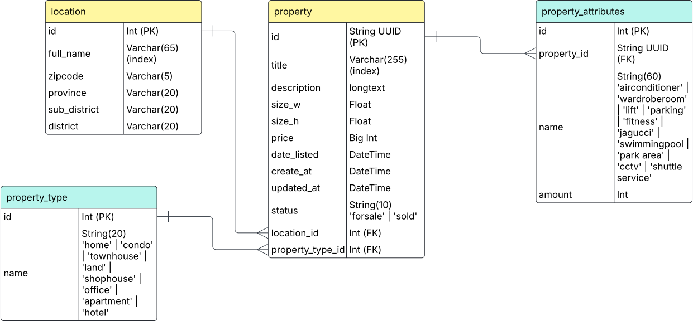

# Database Documentation

## Overview

This document outlines the database design for the Property Storage System. The system is designed to manage property listings with their locations, types, and various attributes.

## Entity Relationship Diagram



## Database Schema

### Tables Description

#### 1. Location (`location`)

Stores geographical information for properties.

Fields:

-   `id` (Int, PK, AUTO_INCREMENT) - Unique identifier
-   `full_name` (Varchar(65), NOT NULL, indexed) - Complete location name
-   `zipcode` (Varchar(5)) - Postal code
-   `province` (Varchar(20)) - Province/State name
-   `sub_district` (Varchar(20)) - Sub-district/Area name
-   `district` (Varchar(20)) - District/City name

#### 2. Property Type (`property_type`)

Defines different categories of properties.

Fields:

-   `id` (Int, PK, AUTO_INCREMENT) - Unique identifier
-   `name` (Varchar(20), NOT NULL) - Type name
    -   Allowed values: 'home', 'condo', 'townhouse', 'land', 'shophouse', 'office', 'apartment', 'hotel'

#### 3. Property (`property`)

Main table storing property listings information.

Fields:

-   `id` (Varchar(36), PK) - UUID unique identifier
-   `title` (Varchar(255), NOT NULL, indexed) - Property listing title
-   `description` (LONGTEXT) - Detailed property description
-   `size_w` (Float) - Width/Frontage size
-   `size_h` (Float) - Height/Depth size
-   `price` (BIGINT, NOT NULL) - Property price
-   `date_listed` (DATETIME, NOT NULL) - Date when property was listed
-   `created_at` (DATETIME, NOT NULL) - Record creation timestamp, auto-set
-   `updated_at` (DATETIME, NOT NULL) - Last update timestamp, auto-updated
-   `status` (Varchar(10), NOT NULL) - Current status
    -   Allowed values: 'forsale', 'sold'
-   `location_id` (Int, NOT NULL, FK) - Reference to location table
-   `property_type_id` (Int, NOT NULL, FK) - Reference to property type table

#### 4. Property Attributes (`property_attributes`)

Stores additional features and amenities of properties.

Fields:

-   `id` (Int, PK, AUTO_INCREMENT) - Unique identifier
-   `property_id` (Varchar(36), NOT NULL, FK) - Reference to property table
-   `name` (Varchar(60), NOT NULL) - Attribute name
    -   Allowed values: 'airconditioner', 'wardroberoom', 'lift', 'parking', 'fitness', 'jagucci', 'swimmingpool', 'park area', 'cctv', 'shuttle service'
-   `amount` (Int, NOT NULL, DEFAULT 1) - Quantity of the attribute

## Database Creation Scripts

```sql
CREATE TABLE `location` (
  `id` Int NOT NULL AUTO_INCREMENT,
  `full_name` Varchar(200) NOT NULL,
  `zipcode` Varchar(5),
  `province` Varchar(60),
  `sub_district` Varchar(60),
  `district` Varchar(60),
  PRIMARY KEY (`id`),
  INDEX `idx_location_full_name` (`full_name`)
);

CREATE TABLE `property_type` (
  `id` Int NOT NULL AUTO_INCREMENT,
  `name` Varchar(20) NOT NULL,
  PRIMARY KEY (`id`),
  CONSTRAINT `chk_property_type_name` CHECK (
    `name` IN ('home', 'condo', 'townhouse', 'land', 'shophouse', 'office', 'apartment', 'hotel')
  )
);

CREATE TABLE `property` (
  `id` Varchar(36) NOT NULL,
  `title` Varchar(255) NOT NULL,
  `description` LONGTEXT,
  `size_w` Float,
  `size_h` Float,
  `price` BIGINT NOT NULL,
  `date_listed` DATETIME NOT NULL,
  `created_at` DATETIME NOT NULL DEFAULT CURRENT_TIMESTAMP,
  `updated_at` DATETIME NOT NULL DEFAULT CURRENT_TIMESTAMP ON UPDATE CURRENT_TIMESTAMP,
  `status` Varchar(10) NOT NULL,
  `location_id` Int NOT NULL,
  `property_type_id` Int NOT NULL,
  PRIMARY KEY (`id`),
  INDEX `idx_property_title` (`title`),
  CONSTRAINT `fk_property_location` FOREIGN KEY (`location_id`) REFERENCES `location` (`id`) ON DELETE CASCADE ON UPDATE CASCADE,
  CONSTRAINT `fk_property_type` FOREIGN KEY (`property_type_id`) REFERENCES `property_type` (`id`) ON DELETE CASCADE ON UPDATE CASCADE,
  CONSTRAINT `chk_property_status` CHECK (`status` IN ('forsale', 'sold'))
);

CREATE TABLE `property_attributes` (
  `id` Int NOT NULL AUTO_INCREMENT,
  `property_id` Varchar(36) NOT NULL,
  `name` Varchar(60) NOT NULL,
  `amount` Int NOT NULL DEFAULT 1,
  PRIMARY KEY (`id`),
  CONSTRAINT `fk_property_attributes_property` FOREIGN KEY (`property_id`) REFERENCES `property` (`id`) ON DELETE CASCADE ON UPDATE CASCADE,
  CONSTRAINT `chk_property_attributes_name` CHECK (
    `name` IN (
      'airconditioner', 'wardroberoom', 'lift', 'parking',
      'fitness', 'jagucci', 'swimmingpool', 'park area',
      'cctv', 'shuttle service'
    )
  )
);
```

## Indexes and Constraints

### Primary Keys

-   `location.id` (AUTO_INCREMENT)
-   `property_type.id` (AUTO_INCREMENT)
-   `property.id` (UUID format)
-   `property_attributes.id` (AUTO_INCREMENT)

### Foreign Keys

-   `fk_property_location`: `property.location_id` → `location.id` (CASCADE on DELETE and UPDATE)
-   `fk_property_type`: `property.property_type_id` → `property_type.id` (CASCADE on DELETE and UPDATE)
-   `fk_property_attributes_property`: `property_attributes.property_id` → `property.id` (CASCADE on DELETE and UPDATE)

### Indexes

-   `idx_location_full_name`: `location.full_name` - For faster location searches
-   `idx_property_title`: `property.title` - For faster property searches

### Check Constraints

-   `chk_property_type_name`: Validates property type names
-   `chk_property_status`: Validates property status values
-   `chk_property_attributes_name`: Validates property attribute names

### Default Values

-   `property_attributes.amount`: Defaults to 1
-   `property.created_at`: Set to `CURRENT_TIMESTAMP`
-   `property.updated_at`: Set to `CURRENT_TIMESTAMP` and updates automatically

## Data Types and Validation

### UUID Format

-   Property IDs use UUID format (36 characters)
-   Format: xxxxxxxx-xxxx-xxxx-xxxx-xxxxxxxxxxxx

### Enum Values

1. Property Status:

    - 'forsale'
    - 'sold'

2. Property Types:

    - 'home'
    - 'condo'
    - 'townhouse'
    - 'land'
    - 'shophouse'
    - 'office'
    - 'apartment'
    - 'hotel'

3. Property Attributes:
    - 'airconditioner'
    - 'wardroberoom'
    - 'lift'
    - 'parking'
    - 'fitness'
    - 'jagucci'
    - 'swimmingpool'
    - 'park area'
    - 'cctv'
    - 'shuttle service'

### Field Constraints

1. Text Fields:

    - Location names: max 65 characters
    - Property titles: max 255 characters
    - Attribute names: max 60 characters
    - Status: max 10 characters
    - Property types: max 20 characters

2. Numeric Fields:

    - Prices: BIGINT for large values
    - Sizes: FLOAT for decimal precision
    - Amounts: INT for whole numbers

3. Date Fields:
    - All timestamps use DATETIME
    - Automatic handling of created_at/updated_at

## Best Practices and Conventions

1. **Timestamps**

    - All timestamps are stored in UTC
    - `created_at` and `updated_at` are automatically managed by Laravel

2. **Soft Deletes**

    - Not implemented in current schema
    - Consider adding if needed for data retention

3. **String Lengths**

    - Location names: max 65 characters
    - Property titles: max 255 characters
    - Attribute names: max 60 characters

4. **Numeric Constraints**
    - Prices are stored as Big Int to handle large values
    - Sizes are stored as Float for decimal precision

## Migration and Seeding

For development and testing, use Laravel's migration and seeding commands:

```bash
# Run migrations
./vendor/bin/sail artisan migrate

# Run seeders
./vendor/bin/sail artisan db:seed

# Refresh database (drop all tables and re-run migrations)
./vendor/bin/sail artisan migrate:refresh --seed
```
